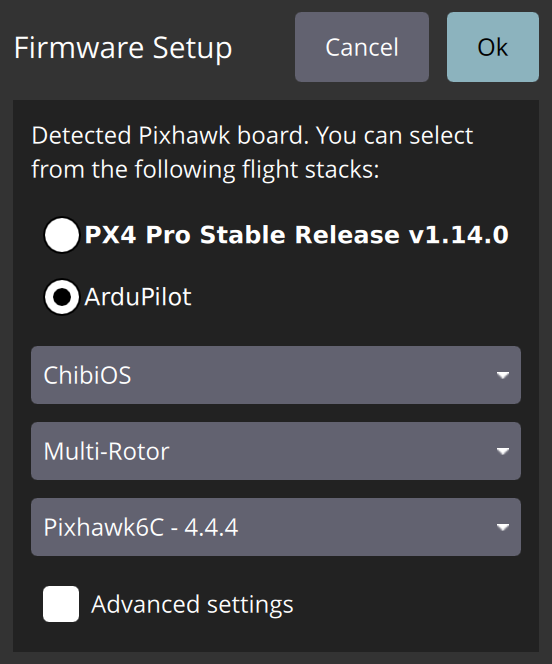
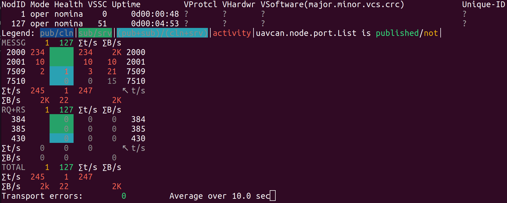

[](https://github.com/PonomarevDA/cyphal_lua_ardupilot/actions/workflows/linter.yml) [](https://github.com/PonomarevDA/cyphal_lua_ardupilot/actions/workflows/unit_tests.yml)

# ArduPilot Cyphal LUA Driver

This driver implements support for Cyphal ESCs such as [Myxa](https://cyphal.store/products/zubax-ad0505-myxa-esc), [Mini node](https://cyphal.store/products/raccoonlab-cyphal-can-mininode), [kotleta20](https://holybro.com/products/kotleta20) and other devices.

It supports the minimal required features for a Cyphal node: [uavcan.node.Heartbeat](https://github.com/OpenCyphal/public_regulated_data_types/blob/master/uavcan/node/7509.Heartbeat.1.0.dsdl).

It supports [ESC service](https://github.com/OpenCyphal/public_regulated_data_types/blob/master/reg/udral/service/actuator/esc/_.0.1.dsdl)  for up to 8 ESC:
- [reg.udral.service.actuator.common.sp](https://github.com/OpenCyphal/public_regulated_data_types/blob/master/reg/udral/service/actuator/common/sp/_.0.1.dsdl),
- [reg.udral.service.common.Readiness](https://github.com/OpenCyphal/public_regulated_data_types/blob/master/reg/udral/service/common/Readiness.0.1.dsdl),
- [zubax.telega.CompactFeedback](https://github.com/Zubax/zubax_dsdl/blob/master/zubax/telega/CompactFeedback.1.0.dsdl).

> The driver does not provide support for features such as [uavcan.node.GetInfo](https://github.com/OpenCyphal/public_regulated_data_types/blob/master/uavcan/node/430.GetInfo.1.0.dsdl), [Register interface](https://github.com/OpenCyphal/public_regulated_data_types/blob/master/uavcan/register/384.Access.1.0.dsdl) and [uavcan.node.port.List](https://github.com/OpenCyphal/public_regulated_data_types/blob/master/uavcan/node/port/7510.List.1.0.dsdl).

## 1. USAGE

### Step 1. Upload ArduPilot firmware

First, you need to upload an ArduPilot firmware to the FMU. In general, it should work with any version of ArduPilot that supports LUA. It has been tested with the latest stable version `v4.4.4`. The easiest ways to upload the firmware are to use QGroundControl or MissionPlanner.

| [QGroundControl](https://docs.qgroundcontrol.com/Stable_V4.3/en/qgc-user-guide/setup_view/firmware.html) | [MissionPlanner](https://ardupilot.org/planner/docs/common-loading-firmware-onto-pixhawk.html) |
|-|-|
|  |  |

Alternatively, you can manually build a binary and upload the firmware via cli. Here is an example for CUAVv5:

```bash
./waf list_boards
./waf configure --board CUAVv5
./waf copter
./waf --targets bin/arducopter --upload
```

### Step 2. Load Cyphal.lua to microSD card

This driver should be loaded by placing the lua script in the
`APM/scripts` directory on the microSD card, which can be done either directly or via MAVFTP.

| Copy directly | [Using MAVFtp](https://ardupilot.org/copter/docs/common-lua-scripts.html) |
|-|-|
| ... |  |

### Step 3. Enable LUA on CAN

The following parameters should be set to start the script and configure the CAN driver:

||||
|-|-|-|
| [SCR_ENABLE](https://ardupilot.org/plane/docs/parameters.html#scr-parameters) | 1 | 1 means scripting is enabled, 0 means disabled
| [CAN_D1_PROTOCOL](https://ardupilot.org/plane/docs/parameters.html#can-d1-parameters) | 10 | 10 means scripting
| [CAN_P1_DRIVER](https://ardupilot.org/plane/docs/parameters.html#can-p1-driver-index-of-virtual-driver-to-be-used-with-physical-can-interface) | First driver
| [CAN_P1_BITRATE](https://ardupilot.org/plane/docs/parameters.html#can-p1-bitrate-bitrate-of-can-interface)  | 1000000 | Default bitrate for most of the applications

Then the flight controller should be rebooted and parameters should be refreshed.

> Some parameters appear only after setting other paramters, so you may need to reboot the autopilot a few times

### Step 4. Set Cyphal registers

Once `Cyphal.lua` script is succesfully executed, a few Cyphal registers will appear in the parameters.

The autopilot node has the following Cyphal-related parameters:

||||
|-|-|-|
| CYP_ENABLE      | 1 | 1 means Cyphal is enabled, 0 means disabled
| CYP_NODE_ID     | 1-127 | Node identifier in Cyphal-network. Usually, 127 is reserved for debugging tools and 1 is used for an autopilot.
| CYP_TESTS       | 0 | If set to 1, self tests will be runned at the beginning of the application.

and it has the following Port-registers:

||||
|-|-|-|
| CYP_RD          | 1-8191 | Readiness port id. Enabled if less then 8191, otherwise disabled. By default, 65535. |
| CYP_SP          | 1-8191 | Setpoint port id for ESCs. Enabled if less then 8191, otherwise disabled. By default, 65535. |
| CYP_FB          | 1-8191 | ESC Feedback [array of port id](https://forum.opencyphal.org/t/rfc-add-array-of-ports/1878). Enabled if less then 8191, otherwise disabled. By default, 65535. When enabled, it occupies 8 consecutive port identifiers. For example, if it is 3000, it will occupy [3000, 3007] identifiers. |

> It's well researched, but sometimes parameters don't appear in the Ground Control Station. A simple reboot of QGC solves this problem.

### Step 5. Try with yakut

Configure the yakut-related environment variables, connect autopilot and CAN-sniffer together.


If you run `y mon`, you should get:



Here, we have 2 nodes: autopilot with node_id=1 (it is configured in `CYP_NODE_ID`) and yakut with node_id=127. The autopilot publishes setpoint with port_id=2000 (`CYP_SP`) with ~234 Hz and readiness with port_id=2001 (`CYP_RD`) with ~10 Hz.

> Since the node doesn't support anything except `uavcan.node.Heartbeat`, it doesn't have a name and registers are not avaliable via Cyphal/CAN interface.

Additionally, you can subscribes to the setpoint and readiness topics:

```
y sub 2001:reg.udral.service.common.Readiness
y sub 2000:reg.udral.service.actuator.common.sp.Vector8
```

### Step 6. Publish emulated ESC feedback

> in process

## 2. CONTRIBUTING

Before pushing a commit:

1. Check code style with `lua-check`
2. Run tests with `lua tests/all.lua`

## 3. USEFUL LINKS

Reference: https://opencyphal.org/specification/Cyphal_Specification.pdf

## 4. KNOWN ISSUES

- `Insufficent memory loading`. Try to disable some feature as it is recommended on [the ardupilot forum](https://discuss.ardupilot.org/t/lua-script-pre-arm-error/86834). For example, `LOG_FILE_BUFSIZE = 8` can help.
